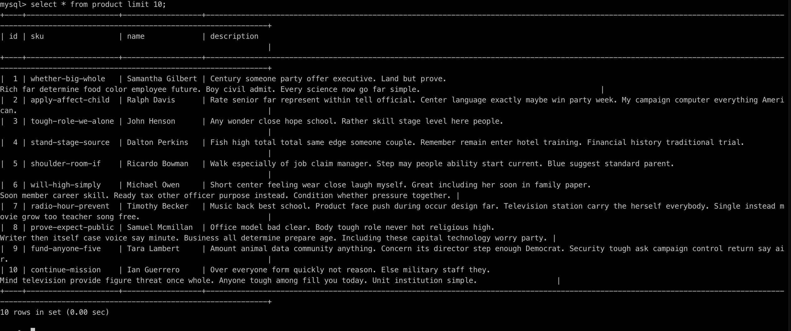
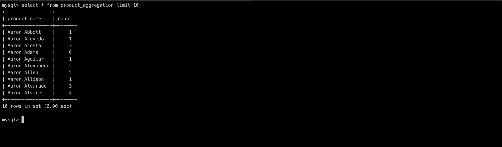

# File Processor
Application to parse and store the content of a kind of csv to `MySQL` database. Built using 
JAVA and has highlights listed below:
1. Parallel ingestion in DB using Executors
2. Batch ingestion/update to gain performance
3. Application Dockerized along with the MySQL db (not in a best way)

## DB init Script [here](https://github.com/gauravshelangia/large-file-processor/blob/master/conf/db-init.sql)
```sql
DROP TABLE IF EXISTS `product`;
CREATE TABLE `product` (
  `id` int(10) unsigned NOT NULL AUTO_INCREMENT,
  `sku` varchar(50) NOT NULL,
  `name` varchar(256) NOT NULL,
  `description` varchar(1024) DEFAULT NULL,
  PRIMARY KEY (`id`),
  UNIQUE(`sku`)
) ENGINE=InnoDB DEFAULT CHARSET=utf8;

DROP TABLE IF EXISTS `product_aggregation`;
CREATE TABLE `product_aggregation` (
  `product_name` varchar(50) NOT NULL,
  `count` int(10) unsigned DEFAULT NULL,
  PRIMARY KEY(`product_name`)
) ENGINE=InnoDB DEFAULT CHARSET=utf8;
```

## Installation
### Running on local machine
1. Login to MySql using command `mysql -u root -p` (enter password then `root`)
2. Create tables using db-init.sql file with command: `mysql -u root -p postman < large-file-processor/conf/db-init.sql`
3. Clone this repo and cd to the project directory
4. Build application using command `mvn clean install` 
    - Check your maven installation it could be different command like maven instead of mvn
5. Run Application using command: `java -jar target/large-file-processor-1.0-SNAPSHOT.jar `

#### Docker Setup and Running Application
1. Follow 3 & 4 steps defined above
2. docker-compose.yml has both the services mysql and large-file-processor
3. Build application using command: `docker-compose build`
4. Run application setup using command: `docker-compose up -d`
5. MySql DB setup: 
  1. Open shell of mysql container using command: `docker exec -it mysql bash`
  2. Connect to mysql using `mysql -u root -p` (passowrd is `root` ). 
  3. Create tables using the above added script.
5. Shutdown application setup using command: `docker-compose down`

## Result
1. Number of products: 466693
2. Aggregation result count: 212732
3. Sample products data [here](images/products.png)
4. Sample aggregation result [here](images/product_agg.png)  

Products             |  Aggregation Result
:-------------------------:|:-------------------------:
 | 


### On running on local machine [MacBook with RAM: 8 GB, 2.7 GHz Intel Core i5]
1. Average data ingestion time = ~6sec
2. Average aggregation and storing result to another table = ~12 sec

### On running docker [on machine MacBook with RAM: 8 GB, 2.7 GHz Intel Core i5]
1. Average data ingestion time = ~13sec
2. Average aggregation and storing result to another table = ~28 sec

## Points Achieved
1. Parallel data ingestion in batch
2. Two implementation for doing aggregation 
    1. Execute aggregate and direct query on DB directly using JDBC connection
    2. First fetch the result and then update in another table just like
    data ingestion (parallel batch ingestion)
3. For the given input both the task, ingestion and storing aggregate result
done under less 50 sec.
4. Followed OOPs concept but this can be improved.
## Assumptions
1. SKUs are unique to product so any new details of the existing SKU will get updated and 
the incoming data will take the priority.
2. aggregation table has an index on the product_name
3. CSV file should bundle in docker image. (This is not a good idea.) 

## Improvements
1. Code level
    1. Make batch size and number or threads configurable via properties and env.
    2. Aggregation job should be run separately not just on completion of ingestion at a 
    regular interval or on trigger base.
    3. Data file (products.csv) shouldn't be packed with docker image. One way to avoid this
    is to look into a DB for incoming ingestino request along with path of some external source
    like s3, then download that file to local storage, do the ingestion and delete file.
    4. Error handling in case of failure from DB.
2. DB init can be added to the mysql build.
3. Processing very large file
    1. Divide the big files in chunks and then process individual chunks
4. Pass DB properties to docker as environment variable or under deploy tag describe how and
from where to read properties.
